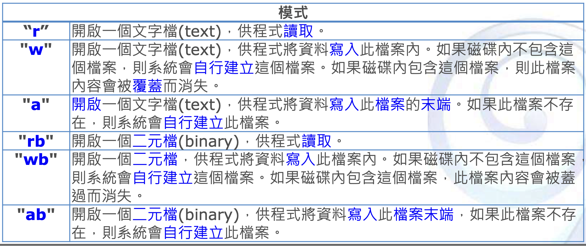

# C_Basic Topic 9

## File IO

Sometimes we want to use C program to handle IO of File, in C, we can use file pointer to represent a file(In Linux C, we use file descriptor fd)

```
FILE *in;
```

### fopen

We can use fopen to open a file, and fclose works to close a file.

```
#include <stdio.h>

int main(){
  FILE *in;
  in = fopen("input.txt","r") // read only
  fclose(in);
}
```
#### mode




### fscanf,fprintf

We can use fscanf to read a string from a file


